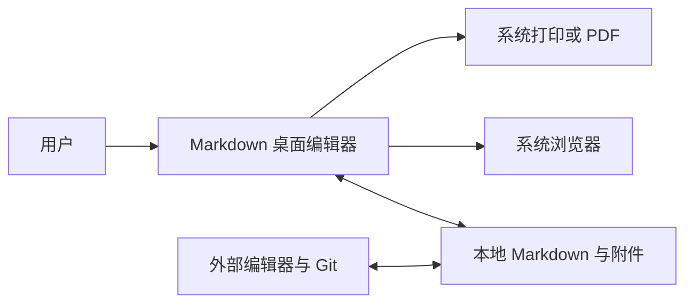
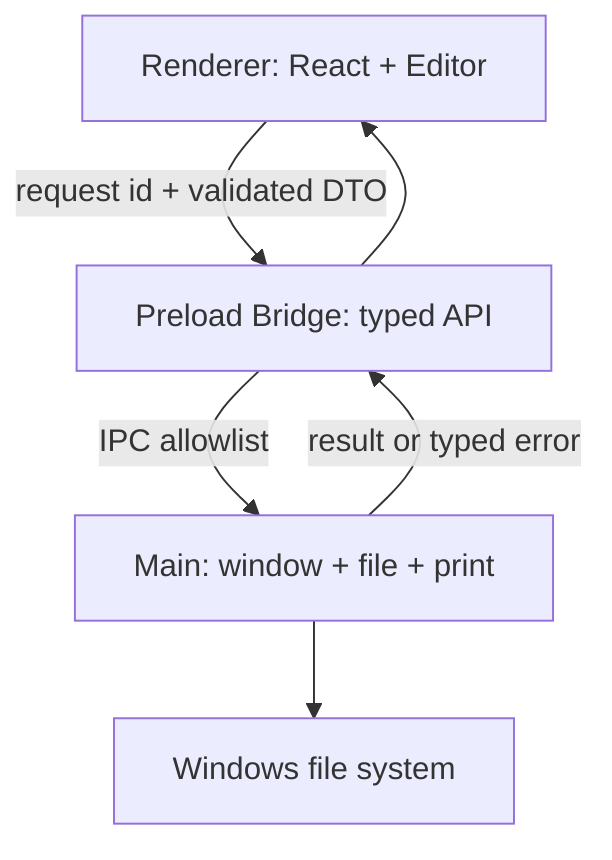
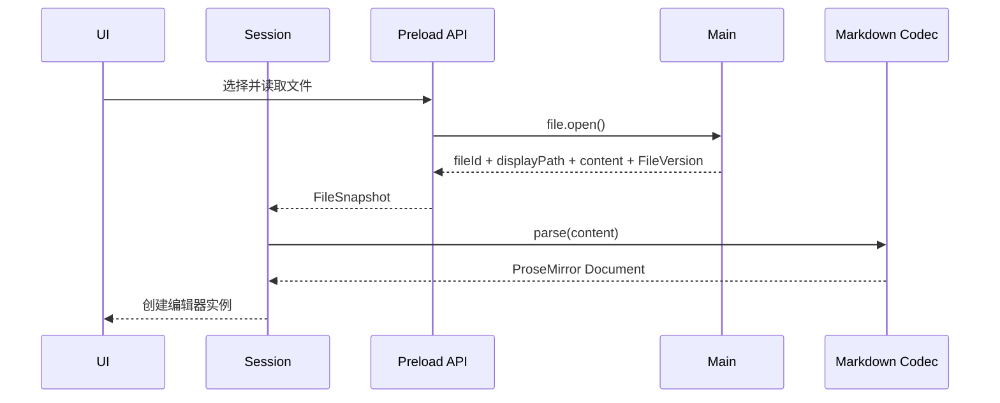
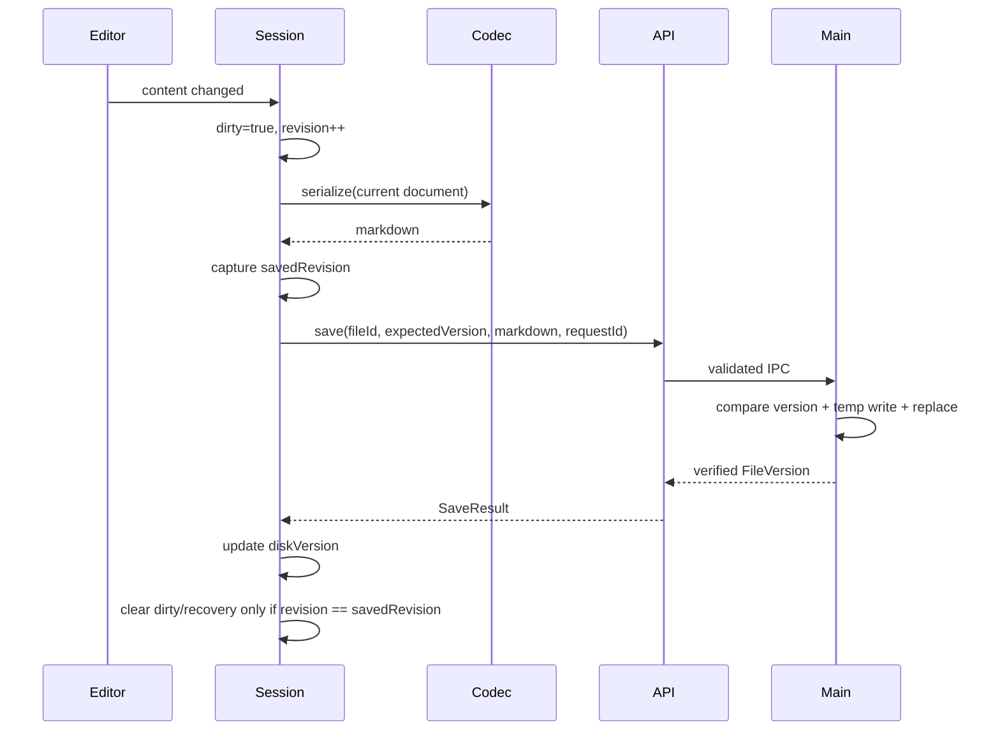
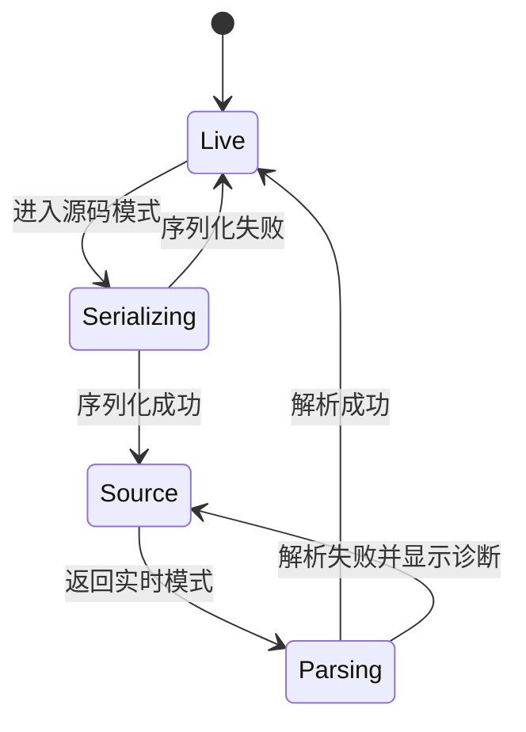

# Markdown 编辑器总体架构

> 标签：#markdown编辑器 #软件架构 #electron #分层架构
> 日期：2026-08-06

## 架构目标

- 编辑器内核不依赖 Electron API；
- renderer 不直接访问 Node.js；
- 文件写入只有一个入口；
- 编辑高频状态不经过 React 全局状态；
- 模式切换、保存和冲突都有明确状态机；
- 第一版保持简单，同时为后续模块提取保留边界。

## 系统上下文



系统不拥有用户文件，只在用户授权的路径上读写。VS Code、Typora、Obsidian 或 Git 可能同时修改文件，因此外部修改是正常场景，不是异常边界。

## Electron 进程架构



### Main 进程

负责窗口、菜单、生命周期、文件对话框、文件读写、原子保存、文件监听、打印和外链。它不持有编辑器文档树，也不包含 React 业务逻辑。

### Preload

是 renderer 与主进程之间唯一桥梁。只通过 `contextBridge` 暴露精确、类型化、可验证的 API，不透传 `ipcRenderer`、`fs`、`shell` 或任意 channel。

### Renderer

负责 React UI、编辑器、会话状态和用户交互。按普通不可信 Web 页面设计，不假设拥有本机权限。

安全细节见 [[Electron安全架构]]。

## Renderer 分层

```text
Presentation
  React 页面、菜单、对话框、组件
      |
Application
  DocumentSession、命令、用例、状态机
      |
Domain / Core
  Editor、Markdown codec、冲突模型、文件引用值对象
      |
Ports
  FilePort、DialogPort、PrintPort、RecoveryPort
      |
Preload Adapter
  window.desktopAPI
```

### 依赖规则

- `Presentation` 可以调用 Application，用订阅获得投影状态；
- Application 可以调用 Core 和 Port 接口；
- Core 不依赖 React、Electron、Zustand；
- Adapter 实现 Port，但业务代码不依赖 Adapter；
- 不建立万能 `EventBus`，模块通信优先使用显式方法和领域事件；
- 输入、光标和 transaction 不发到全局总线。

## 核心运行状态

```ts
type FileRef = {
  id: string;
  displayPath: string;
};

type DocumentSession = {
  id: string;
  file?: FileRef;
  mode: 'live' | 'source';
  dirty: boolean;
  revision: number;
  saveState: 'idle' | 'saving' | 'failed';
  conflict?: {
    actual: FileVersion;
    detectedAt: number;
  };
  recoveryState: 'none' | 'available' | 'restored';
  recoveryCheckpoint?: {
    revision: number;
    persistedAt: number;
  };
  diskVersion?: {
    mtimeMs: number;
    size: number;
    contentHash: string;
  };
  recoveryId: string;
};
```

`DocumentSession` 只保存协调信息，但它是 dirty、saveState、conflict、recoveryState 和 revision 的唯一写入权威。ProseMirror `EditorState` 留在编辑器实例中，源码字符串只在源码模式实例中。Zustand 可以订阅 `DocumentSession` 快照供 React 展示，不能直接修改这些字段；UI 必须调用 Application 命令触发状态迁移。不要把整篇正文存入 Zustand。

`FileRef.id` 是 Main 进程为当前窗口签发的不透明文件能力，Main 保存 `window + fileId -> canonicalPath` 映射。Renderer 可以获得用于展示的 `displayPath`，但保存、监听和附件操作不能把它当授权依据，也不能提交任意绝对路径。

阶段 1 的 `source` 是解析失败或高风险语法文件的最小安全源码兜底，阶段 3 才由 CodeMirror 6 提供完整源码体验。状态机契约不依赖具体文本控件。

## 打开文件数据流



解析失败时不能覆盖当前会话。应打开安全源码视图、显示错误位置，并允许另存为或取消。

## 保存数据流



每个会话最多只能有一个保存请求在途。保存期间继续输入时，只记录“需要再次保存”并合并到最新 revision，不能并行写同一文件。旧 revision 保存成功后仍要用返回值更新 `diskVersion`，但必须保持 dirty，不能清理较新的恢复草稿；随后使用新的 `diskVersion` 保存最新内容。

Main 按 `sender + requestId` 对重复 IPC 请求去重：在途请求复用同一 Promise，已完成请求在短期窗口内返回相同结果，避免重试造成二次写入。同一个 requestId 必须绑定相同 payload 摘要，若内容不同则拒绝。完整协议见 [[文件与数据安全]]。

## 模式切换状态机



源码和实时编辑器不同时接受输入。切换前记录光标锚点，切换后尽力映射；第一版只保证定位到相邻块，不承诺逐字符位置完全一致。

## 后续演进边界

只有出现以下真实需求，才拆 package 或增加进程：

- Web 版需要复用编辑器：提取 `editor-core`；
- Markdown 转换需要在后台执行：增加 Worker；
- 全库搜索影响 UI：增加 search worker 或独立进程；
- 插件必须运行不可信代码：设计独立沙箱和权限模型。

不要为了“将来可能上 Tauri”提前包装所有 API。先保持 Port 小而明确，迁移发生时再评估。

## 相关笔记
- [[项目蓝图]] - 总体架构服务于蓝图目标
- [[模块与目录设计]] - 把分层映射成代码目录
- [[编辑器内核设计]] - 编辑器内部状态和转换细节
- [[文件与数据安全]] - 打开、保存与冲突的实现要求
- [[Electron安全架构]] - 进程边界的安全约束
- [[功能设计模板]] - 新功能必须映射到架构分层
- [[技术选型与决策]] - 各层采用技术及替代方案
- [[性能与可观测性]] - 跨层测量点和性能预算
